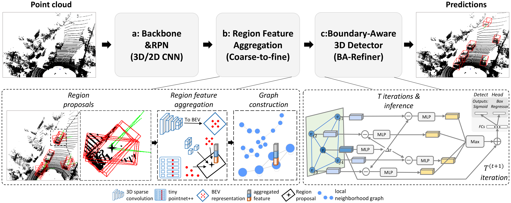

## BADet: Boundary-Aware 3D Object Detection from Point Clouds (Pattern Recognition 2022)
As of Apr. 17th, 2021, [1<sup>st</sup>](http://www.cvlibs.net/datasets/kitti/eval_object_detail.php?&result=48db930a7077e9925311b2539c21aed7541b7295) place in KITTI BEV detection leaderboard and on par performance on KITTI 3D detection leaderboard. The detector can run at 7.1 FPS. 

**Authors**: [Rui Qian](https://github.com/rui-qian), [Xin Lai](https://github.com/laiguzi), 
[Xirong Li](https://github.com/li-xirong)

[\[arXiv\]](https://arxiv.org/pdf/2104.10330.pdf)
[\[elsevier\]](https://doi.org/10.1016/j.patcog.2022.108524)
## Citation
If you find this code useful in your research, please consider citing our work:
```
@inproceedings{qian_2022_PR,
title = {{BADet}: Boundary-Aware 3D Object Detection
from Point Clouds},
journal = {Pattern Recognition},
volume = {125},
pages = {108524},
year = {2022},
publisher={Elsevier},
author = {Rui Qian and Xin Lai and Xirong Li},
@misc{qian20213d,
title={3D Object Detection for Autonomous Driving: A Survey}, 
author={Rui Qian and Xin Lai and Xirong Li},
year={2021},
eprint={2106.10823},
archivePrefix={arXiv},
primaryClass={cs.CV}
}
```

## Updates

2021-03-17: [The performance (using 40 recall poisitions) on **test** set is as follows](
  http://www.cvlibs.net/datasets/kitti/eval_object_detail.php?&result=48db930a7077e9925311b2539c21aed7541b7295
):
```
Car AP@0.70, 0.70, 0.70:
bbox AP:98.75, 95.61, 90.64
bev  AP:95.23, 91.32, 86.48 
3d   AP:89.28, 81.61, 76.58 
aos  AP:98.65, 95.34, 90.28 
```
# Introduction

Currently, existing state-of-the-art 3D object detectors are in two-stage paradigm. These 
methods typically comprise two steps: 1) Utilize a region proposal network to propose a handful 
of high-quality proposals in a bottom-up fashion. 2) Resize and pool the semantic features from
the proposed regions to summarize RoI-wise representations for further refinement. Note that 
these RoI-wise representations in step 2) are considered individually as uncorrelated entries when fed 
to following detection headers. Nevertheless, we observe these proposals generated by step 1) offset 
from ground truth somehow, emerging in local neighborhood densely with an underlying probability. 
Challenges arise in the case where a proposal largely forsakes its boundary information due to 
coordinate offset while existing networks lack corresponding information compensation mechanism. 
In this paper, we propose $BADet$ for 3D object detection from point clouds. Specifically, instead 
of refining each proposal independently as previous works do, we represent each proposal as a node 
for graph construction within a given cut-off threshold, associating proposals in the form of 
local neighborhood graph, with boundary correlations of an object being explicitly exploited. Besides, 
we devise a lightweight Region Feature Aggregation Module to fully exploit voxel-wise, pixel-wise, 
and point-wise features with expanding receptive fields for more informative RoI-wise representations. 
We validate BADet both on widely used KITTI Dataset and highly challenging nuScenes Dataset.
As of Apr. 17th, 2021, our BADet achieves on par performance on KITTI 3D detection leaderboard and 
ranks $1^{st}$ on $Moderate$ difficulty of $Car$ category on KITTI BEV detection leaderboard. 
The source code is available at https://github.com/rui-qian/BADet.
  
# Dependencies
- `python3.5+`
- `pytorch` (tested on 1.1.0)
- `opencv`
- `shapely`
- `mayavi`
- `spconv` (v1.0)

# Installation
1. Clone this repository.
2. Compile C++/CUDA modules in mmdet/ops by running the following command at each directory, *e.g.*
```bash
$ cd mmdet/ops/points_op
$ python3 setup.py build_ext --inplace
```
3. Setup following Environment variables, you may add them to ~/.bashrc:
```bash
export NUMBAPRO_CUDA_DRIVER=/usr/lib/x86_64-linux-gnu/libcuda.so
export NUMBAPRO_NVVM=/usr/local/cuda/nvvm/lib64/libnvvm.so
export NUMBAPRO_LIBDEVICE=/usr/local/cuda/nvvm/libdevice
export LD_LIBRARY_PATH=/home/qianrui/anaconda3/lib/python3.7/site-packages/spconv;
```

# Data Preparation
1. Download the 3D KITTI detection dataset from [here](http://www.cvlibs.net/datasets/kitti/eval_object.php?obj_benchmark=3d). Data to download include:
    * Velodyne point clouds (29 GB): input data to VoxelNet
    * Training labels of object data set (5 MB): input label to VoxelNet
    * Camera calibration matrices of object data set (16 MB): for visualization of predictions
    * Left color images of object data set (12 GB): for visualization of predictions

2. Create cropped point cloud and sample pool for data augmentation, please refer to [SECOND](https://github.com/traveller59/second.pytorch).

3. Split the training set into training and validation set according to the protocol [here](https://xiaozhichen.github.io/files/mv3d/imagesets.tar.gz).

4. You could run the following command to prepare Data:
```bash
$ python3 tools/create_data.py

qr@Misaki:~/qianrui/kitti$ tree -L 1
data_root = '/home/qr/qianrui/kitti/'
├── gt_database
├── ImageSets
├── kitti_dbinfos_train.pkl
├── kitti_dbinfos_trainval.pkl
├── kitti_infos_test.pkl
├── kitti_infos_train.pkl
├── kitti_infos_trainval.pkl
├── kitti_infos_val.pkl
├── train.txt
├── trainval.txt
├── val.txt
├── test.txt
├── training   <-- training data
|       ├── image_2
|       ├── label_2
|       ├── velodyne
|       └── velodyne_reduced
└── testing  <--- testing data
|       ├── image_2
|       ├── label_2
|       ├── velodyne
|       └── velodyne_reduced
```

# Pretrained Model
You can download the pretrained model [\[Model\]](https://www.icloud.com.cn/iclouddrive/0b3sjFxx1UwVz5jglDx44l3CQ#epoch%5F50)[\[Archive\]](https://www.icloud.com.cn/iclouddrive/070z4g1Id3jSI0RCuZiq6Orkw#BADet), 
which is trained on the train split (3712 samples) and evaluated on the val split (3769 samples) and test split (7518 samples). 
The performance (using 11 recall poisitions) on **validation** set is as follows:
```
[40, 1600, 1408]
[>>>>>>>>>>>>>>>>>>>>>>>>>>>>>>>>>>>>>>>>>>>>>>>>>>] 3769/3769, 7.1 task/s, elapsed: 533s, ETA:     0s
Car AP@0.70, 0.70, 0.70:
bbox AP:98.27, 90.22, 89.66
bev  AP:90.59, 88.85, 88.09
3d   AP:90.06, 85.75, 78.98
aos  AP:98.18, 89.98, 89.25
Car AP@0.70, 0.50, 0.50:
bbox AP:98.27, 90.22, 89.66
bev  AP:98.31, 90.21, 89.73
3d   AP:98.20, 90.11, 89.61
aos  AP:98.18, 89.98, 89.25
```
# Quick demo
You could run the following command to evaluate the pretrained model:
```
cd mmdet/tools
# vim ../configs/car_cfg.py(modify score_thr=0.4, score_thr=0.3 for val split and test split respectively.)
python3 test.py ../configs/car_cfg.py ../saved_model_vehicle/epoch_50.pth
```
|     Model        | Archive     | Parameters | Moderate(Car)  | Pretrained Model                                             | Predicts
| ----------- | --------- | ---------- | --------- | ------------------------------------------------------------ |------------------------------------------------------------ |
| BADet(*val*)       | [\[Link\]](https://www.icloud.com.cn/iclouddrive/0dcDJjo3u-lDDJJ6lIX2P6ypw#BADet) | 44.2 MB    | **86.21%** | [[icloud drive](https://www.icloud.com.cn/iclouddrive/0c7Vb2fMO7gytSCkYZEuU8YRQ#epoch%5F50)] | [\[Results\]](https://www.icloud.com.cn/iclouddrive/0f5PmHRL_DQjb9a0QLofdJ8Tw#BADet%5Fval(86.21%25))|
| BADet(*test*)       | [\[Link\]](https://www.icloud.com.cn/iclouddrive/04028Vv7cpeeuHsJfNzziSLow#archive) | 44.2 MB    | **81.61%** | [[icloud drive](https://www.icloud.com.cn/iclouddrive/0f9KqbDqQDmyXwBF1vaf3F6ow#epoch%5F50)] |[\[Results\]](https://github.com/rui-qian/BADet)|

# Training
To train the BADet with single GPU, run the following command:
```
cd mmdet/tools
python3 train.py ../configs/car_cfg.py
```
# Inference
To evaluate the model, run the following command:
```
cd mmdet/tools
python3 test.py ../configs/car_cfg.py ../saved_model_vehicle/latest.pth
```

## Acknowledgement
The code is devloped based on mmdetection, some part of codes are borrowed from SA-SSD, SECOND, and PointRCNN.
* [mmdetection](https://github.com/open-mmlab/mmdetection) 
* [mmcv](https://github.com/open-mmlab/mmcv)
* [second.pytorch](https://github.com/traveller59/second.pytorch)
* [PointRCNN](https://github.com/sshaoshuai/PointRCNN)
* [SA-SSD](https://github.com/skyhehe123)

## Contact
If you have questions, you can contact qianruii@126.com.
